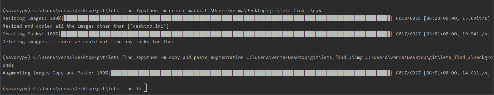
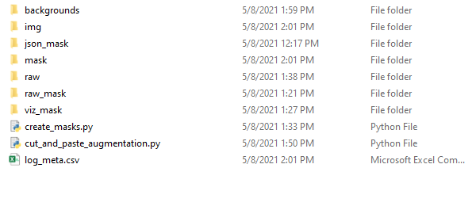
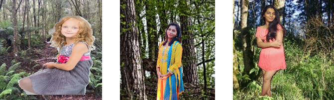
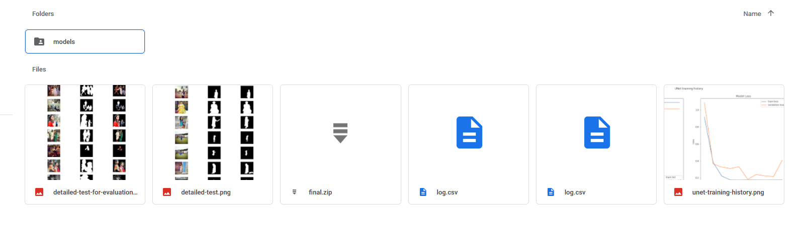
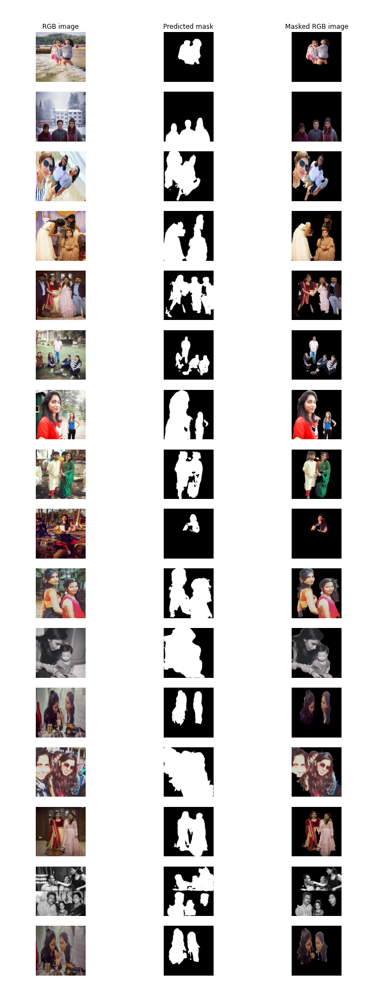

For the project I have use Anaconda environment
but one can easily use Linux for this task as well.
 
# Prerequisits
Create an env for `TP-Projects`. with the all the modules necessary.
 
## Pre-processing usage
Both the scripts are writen as modules and can easily be executed wit CLI
 

`python -m  create_mask <raw_img_dir>`
These images have either gotten a mask or have gotten label-me annotations which can be used to create masks.

`python -m  copy_and_paste_augmentation <raw_img_dir> <background-img-dir>`
The background images should not have any humans otherwise the purpose of this task will not be met.

Folder structure for running this tasks need to be like the following

 
 Some of these folders and files are created after processing raw-images and performing the augmentations.
 The folder which you need are *img*, *json_mask*, *raw* and *raw_mask*.

## Copy and Paste Augmentation

Implements: [Copy-and-Paste a simple augmentation technique](https://arxiv.org/abs/2012.07177)

This is a technique used to improve the size of training samples by copying and pasting the objects masked in an image in another background.
We need to make sure that the orientation for the objects in the augmented images are actually something which a real-scenario can be like. If not
this augmentation can increase the complication for the model. 

Also the extent of augmentation is the key here. We should augment the training image only to avoide any leakage to the test set.
Otherwise the estimated score might be biased.

A few examples of CutAndPaste augmentations are shown below:
 

## Training

Training was done using google-colab to be use a free GPU option.
The notebook can be run as it is in colab if your google drive has access to the final data folder 
which has been used in training if you want access to it contact us.

All the model-checkpoints and visualizations are saved in colab only.

 
 
 
## Testing for evaluation 

These images are not a part of the training set and have been used to evaluate the model's performance only.
The plot shows original-image, its predicted-mask(no true mask created for these) and the masked image.

  
  
# Raw data 

Raw for this project is available if requested. 