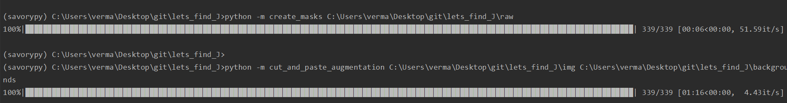
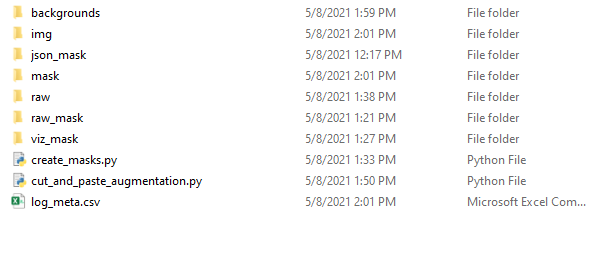
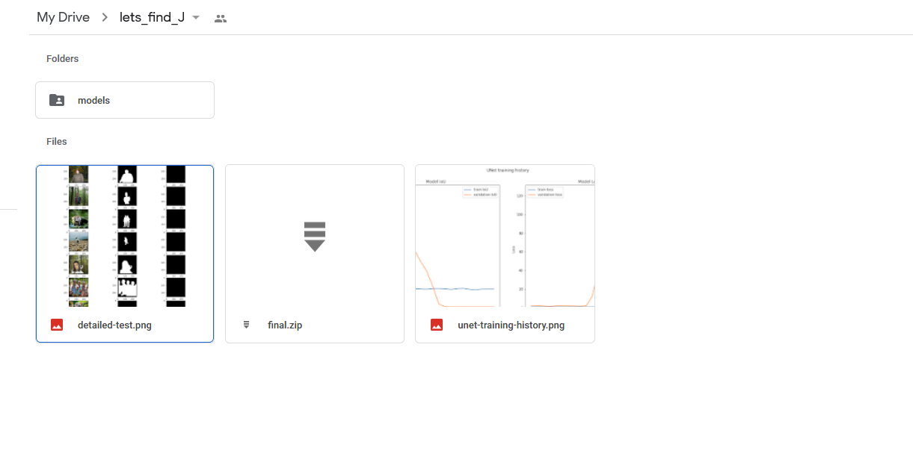

This is the first project which was worked on in some spare time
 and it is still under development. For the project I have use Anaconda environment
 but one can easily use Linux for this task as well.
 
 # PREQUISITS
 
 Create a env for TP-Projects. with the all the modules necessary.
 
 ## Pre-processing usage
 
 Both the scripts are writen as modules and can easily be executed wit CLI
 
 .

`python -m  create_mask <raw_img_dir>`
These images have either gotten a mask or have gotten label-me annotations which can be used to create masks.

`python -m  copy_and_paste_augmentation <raw_img_dir> <background-img-dir>`
The background images should not have any humans otherwise the purpose of this task will not be met.

Folder structure for running this tasks need to be like the following
 .
 
 Some of these folders and files are created after processing raw-images and performing the augmentations.
 The folder which you need are *img*, *json_mask*, *raw* and *raw_mask*.

## Training

Training was done using google-colab to be use a free GPU option.
The notebook can be run as it is in colab if your google drive has access to the final data folder 
which has been used in training if you want access to it contact us.

All the model-checkpoints and visualizations are saved in colab only.

 .